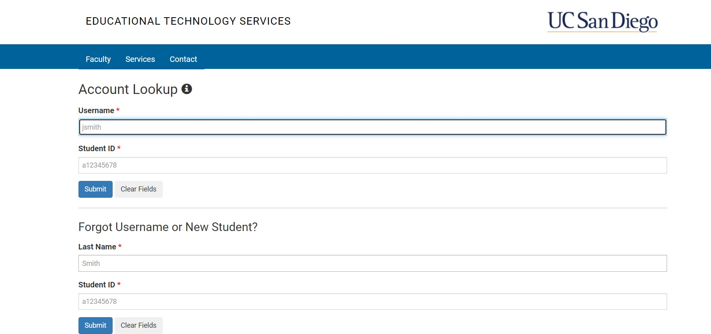
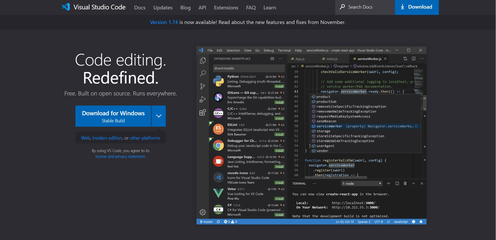
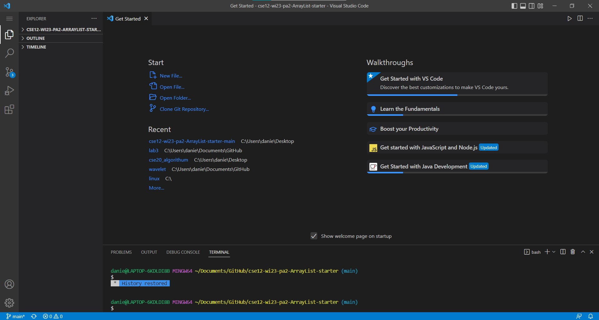
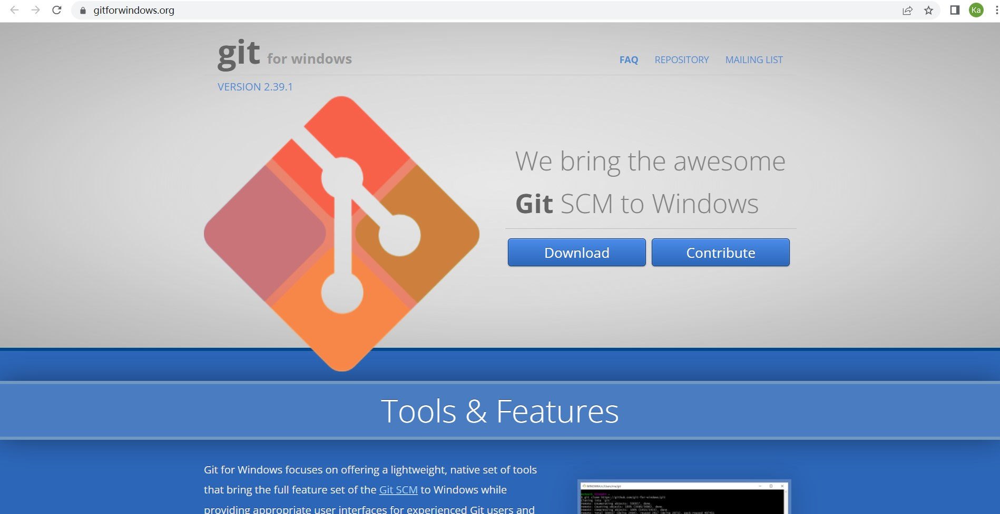
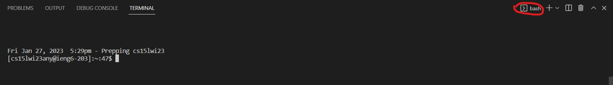
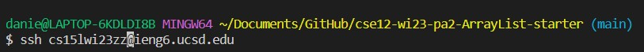
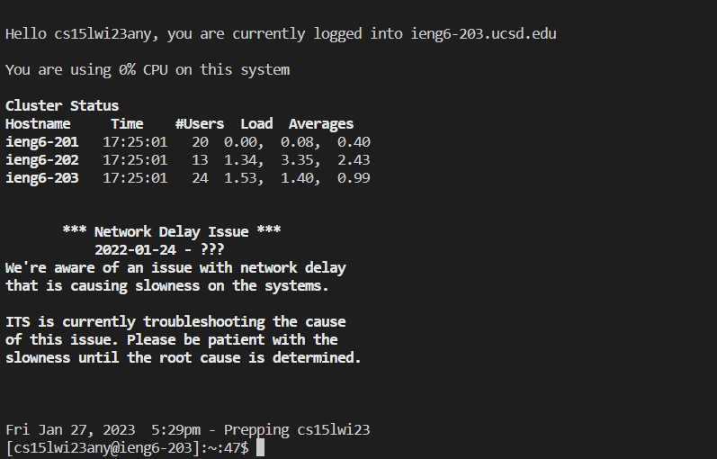
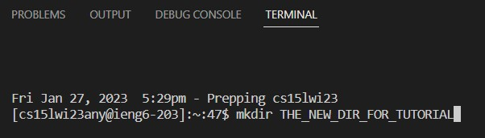
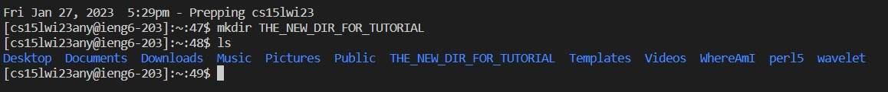

# Lab Report 1
Tutorial to Log into course account on ieng6

## Step 1: Get your CSE15L Course Account

[**_Find your course Account here!_**](https://sdacs.ucsd.edu/~icc/index.php)

* Using the above link to find your course account with your UCSD username and UCSD PID
* Remember to reset your password and wait at most **15 mins** to proceed
* [**_Tutorial of resetting password_**](https://docs.google.com/document/d/1hs7CyQeh-MdUfM9uv99i8tqfneos6Y8bDU0uhn1wqho/edit)

## Step 2: Installing Visual Studio Code and development environment set up
In this class, we mainly Visual Studio Code as your IDE. [**_Download VS Code_**](https://code.visualstudio.com/)

After installing Visual Studio Code you should see a user interface like this

### _If you are using Windows_
* In order to use bash in your Visual Studio Code integrated terminal, you need to download\
[**_Git for Windows_**](https://gitforwindows.org/)

* After Installation, fowllow the instrcutions [Using bash in VS Code](https://stackoverflow.com/questions/42606837/how-do-i-use-bash-on-windows-from-the-visual-studio-code-integrated-terminal/50527994#50527994) to set up bash in your VS Code.

## Step 3: Remotely Connecting
In this class you will need to use the remote server sometimes. After all setting up,

1. Open integrated terminal in your VS Code with Ctrl or Command + `, or use the Terminal → New Terminal menu option, make sure it is correctly set up as bash

2. Use ssh command to log into ieng6 server(replace zz by the letters in your course-specific account)

3. After your login, there may be questions asking, type yes to all, and you should see this when you successful log in. 

## Try some New Command
Try some useful terminal command in both your local server and ssh server.
* cd ~
* cd
* mkdir
* ls -lat
* ls -a
* ls <directory> where <directory> is /home/linux/ieng6/cs15lwi23/cs15lwi23abc, where the abc is one of the other group members’ username
* cp /home/linux/ieng6/cs15lwi23/public/hello.txt ~/
* cat /home/linux/ieng6/cs15lwi23/public/hello.txt/
  
  
  

