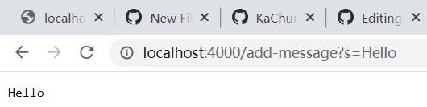
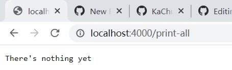
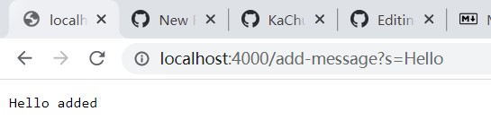
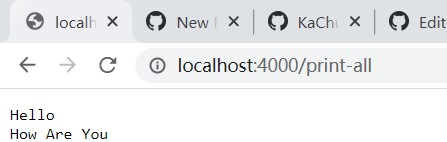
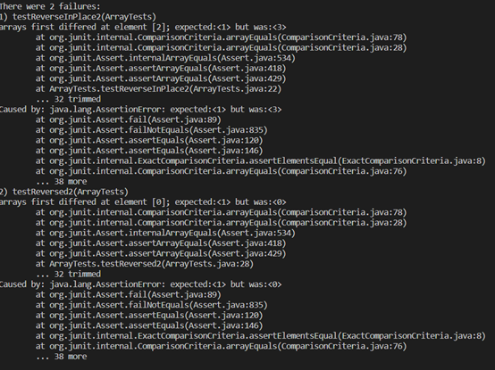
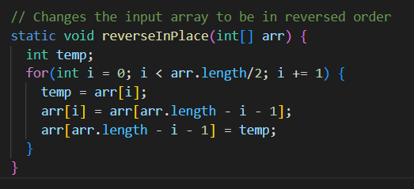

# Lab Report 2
**Servers and Bugs**

## Part 1 Web Server
**Code for the class StringServer:**
```
class StringServer implements URLHandler {
    String defaultString= "There's nothing yet";
    String storedString = "";
    String[] store;
    public String handleRequest(URI url) {
        if (url.getPath().equals("/")) {
            if(store == null){
                return defaultString;
            }
        }
        else {
            System.out.println("Path: " + url.getPath());
            if (url.getPath().contains("/add-message")) {
                store = url.getQuery().split("=");
                if (store[0].equals("s")) {
                    storedString = storedString + store[1]+"\n";
                    return String.format("%s \n", storedString);
                }
            }
            return "404 Not Found!";
        }
    }
}
```
**Code for the main class:**
```
class myTester {
    public static void main(String[] args) throws IOException {
        if(args.length == 0){
            System.out.println("Missing port number! Try any number between 1024 to 49151");
            return;
        }
        int port = Integer.parseInt(args[0]);
        Server.start(port, new StringServer());
    }
}
```

**Doing add meassage "Hello":**



**Doing add meassage "How Are You":**


>**However, for better implementation, I would provide another path that prints out all the containing messages
>and to show the added message only when calling "add-message" path. This can be easier for future search or delete implementation in the web page message**

```
class StringServer implements URLHandler {
    String defaultString= "There's nothing yet";
    String storedString = "";
    String addCommand = "/add-message";
    String printCommand = "/print-all";
    String[] store;

    public String handleRequest(URI url) {
        if (url.getPath().equals("/")) {
            if(store == null){
                return defaultString;
            }
            return String.format("Commands: \n%s\n%s",addCommand,printCommand);
        }
        else {
            System.out.println("Path: " + url.getPath());
            if (url.getPath().contains("/add-message")) {
                store = url.getQuery().split("=");
                if (store[0].equals("s")) {
                    storedString = storedString + store[1]+"\n";
                    return String.format("%s added\n", store[1]);
                }
            }
            if (url.getPath().contains("/print-all")){
                if(storedString.equals("")){
                    return defaultString;
                }
                return storedString;
            }
            return "404 Not Found!";
        }
    }
}
```

**When path empty and print-all with no stored message:**



**Doing add meassage "Hello":**



**Doing add meassage "How Are You":**


**Doing Print-all:**



* For all the functions, the HandleRequest method is called
* The relevant argument would be "add-message"
* Only the integer value would be cast to string, and values are stored in the instance variables storedString

## Part 2 Bugs
**In the reversedInPlace method, if we tried input `{1,2,3}`
the output in tester would result:**



>**Expected `{3,2,1} `, but was `{1,2,3}`**

**In reversedInPlace, in order to fix the bug, need to make a temp int first then make the variable equals arr[i] in the for loop and put back the arr[arr.length-i-1] at the back, as shown below:**



## Part 3 Things I Learned
* How to identify a bug or error in a code
* How to think of more tester case
* What a web server can do
* and how you can implement with a web Server


