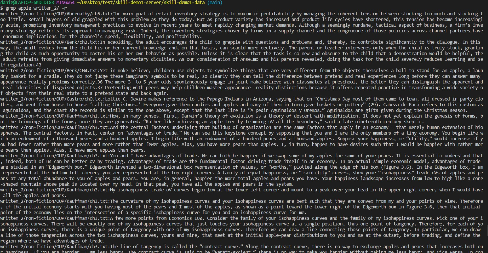
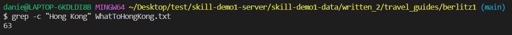
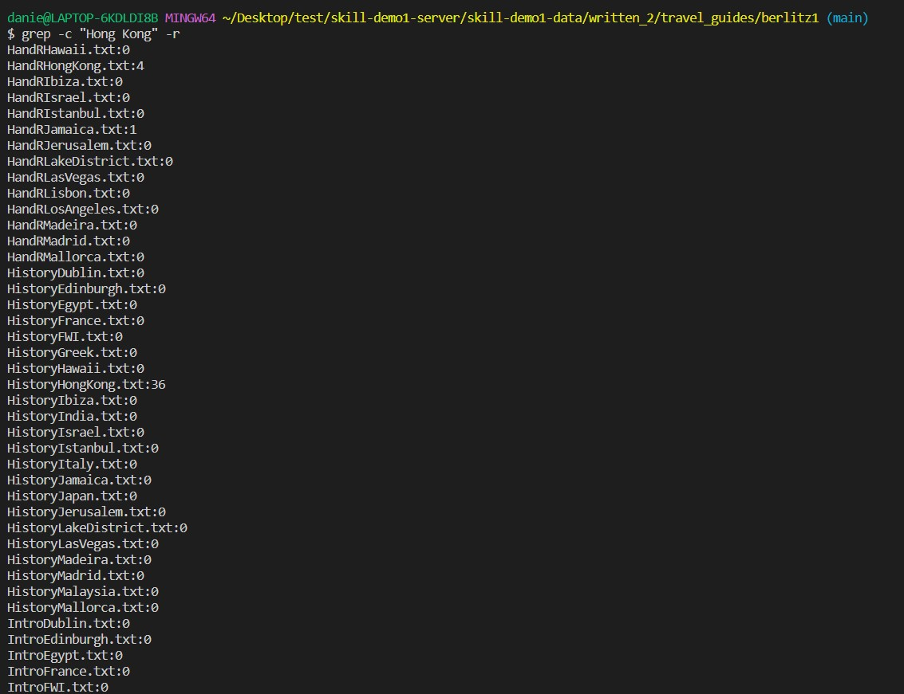
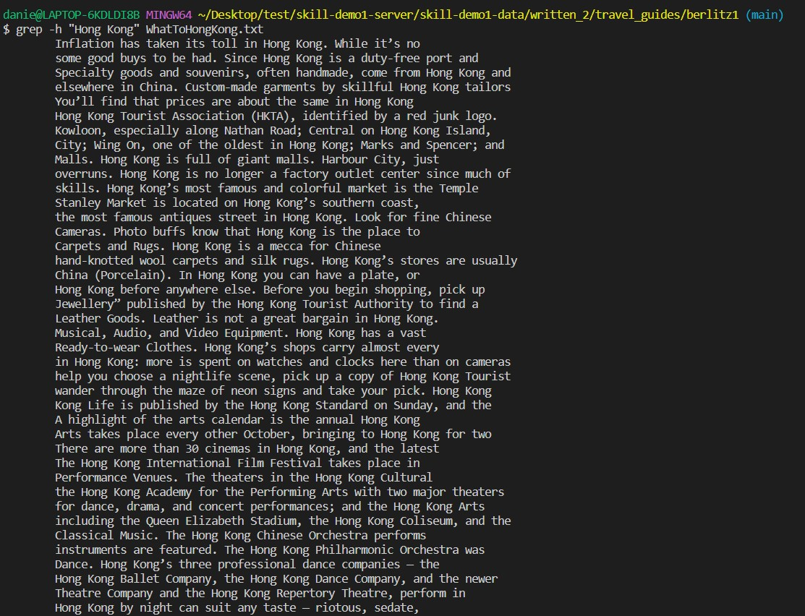
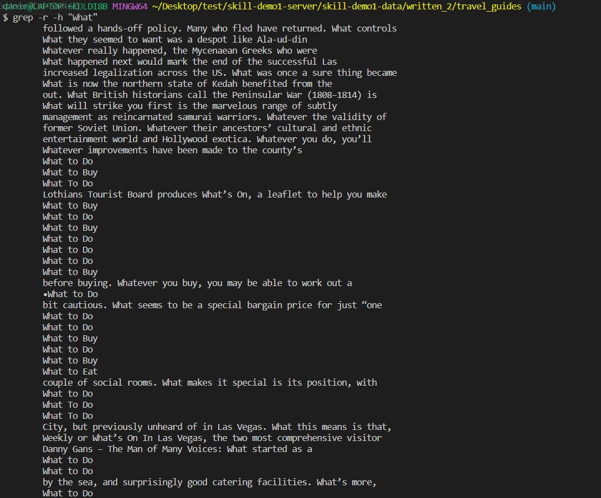
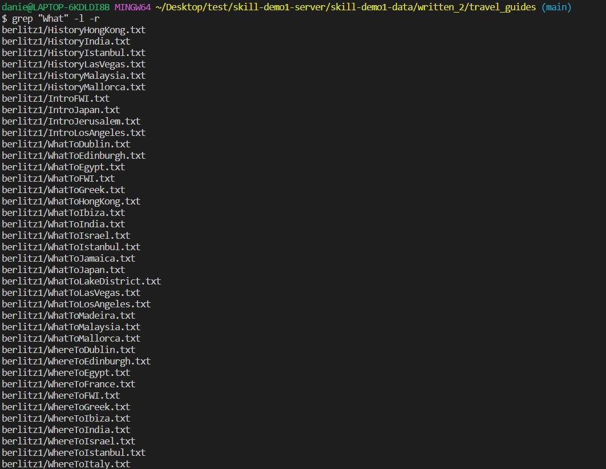
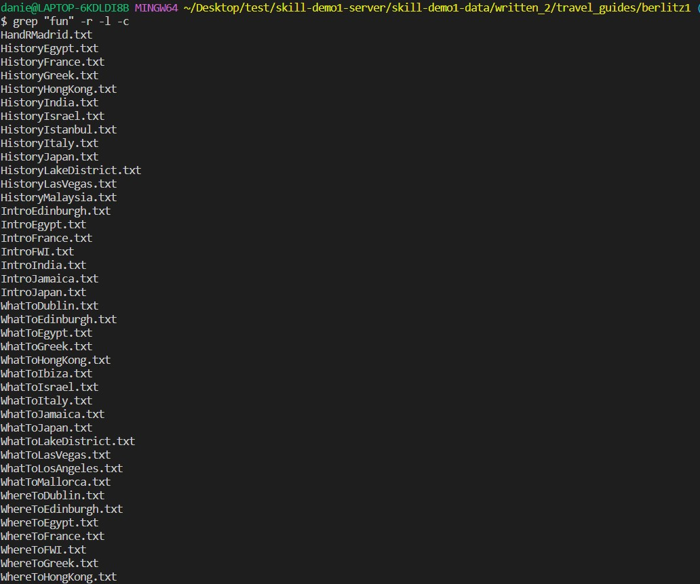

# Lab Report 3
**Researching Commands**

[More grep command option](https://www.geeksforgeeks.org/grep-command-in-unixlinux/)

## *grep* Command

### Search files recursively from subdirectories, starting from the current directory
Using `-r` option in grep can search files recursively from subdirectories, starting from the current directory

You can either put the command option `-r` in the front or in the end

### Prints only a count of the lines that match a pattern
Using `-c` option in grep can print only a count of the lines that match a pattern

You can also use with other command option like `-r`. This can be useful, 
for example, you can search how many lines contains the string "Hong Kong" in every file in the current directory 

### Display the matched lines, but do not display the filenames.
Using `-h` option in grep can display the matched lines, but do not display the filenames

Another example of using `h`

### Displays list of a filenames only.
Using `-l` option in grep can display list of a filenames only.

It could be really useful when only looking for the file for a more clear display in the terminal

