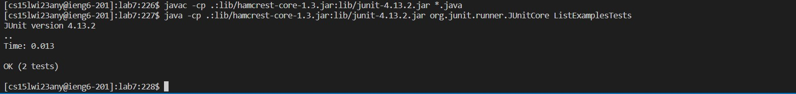

# Lab Report 4
**Challenge Tasks**
## Set up
1. Setup Delete any existing forks of the repository you have on your account
2. Setup Fork the repository
3. Start a timer!

## Part 1: Log into ieng6
Using ssh, type ``ssh cs15lwi23any@ieng6.ucsd.edu`` in your terminal, then with your personal password

## Part 2: Clone your fork of the repository from your Github account
Type ``git clone <your repository url>``

## Part 3: Run the tests, demonstrating that they fail
First, go to the directory where the file need to be test. ``cd lab7``. 

Then run the test by(windows) ``javac -cp .:lib/hamcrest-core-1.3.jar:lib/junit-4.13.2.jar *.java``

and ``java -cp .:lib/hamcrest-core-1.3.jar:lib/junit-4.13.2.jar org.junit.runner.JUnitCore ListExamplesTests``

## Part 4: Edit the code file to fix the failing test
The bug in the code is in line 43, it should be ``index2 += 1;``, 

fix the code by ``nano ListExamplesTests``, then correct the bug,

then press ``<ctrl x>`` to exit, press``<y>``to save, press``<enter>``to confirm.

## Part 5: Run the tests, demonstrating that they now succeed
Press `up` to find the prvious ``javac -cp .:lib/hamcrest-core-1.3.jar:lib/junit-4.13.2.jar *.java`` and ``java -cp .:lib/hamcrest-core-1.3.jar:lib/junit-4.13.2.jar org.junit.runner.JUnitCore ListExamplesTests``
to run the tester agian rapidly.

## Part 6: Commit and push the resulting change to your Github account
type ``git add .`` and then type ``git commit -m <message>``to create a new commit in my Git repository with message of the change. 

At last, type ``git push``to push it to the repository in the Github account.

