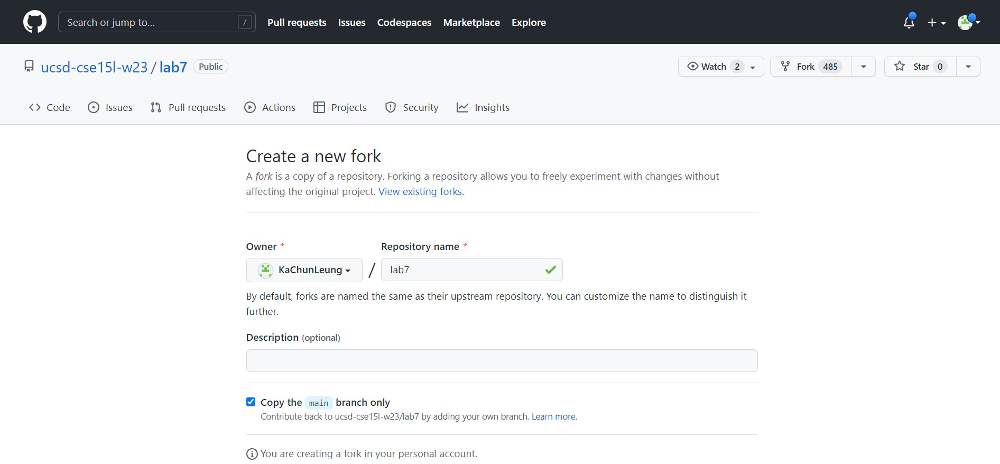

#Lab Report 5
My lab report will be focused on lab report 3, which covers topics such as find and grep.
As an example, I had a file called MyDeque.java that was located within a folder in my download directory (Download Folder -> Some Folder -> MyDeque.java). However, since there were multiple folders within the download directory, I was unsure which folder contained MyDeque.java.

To solve this, I applied the techniques I learned from report 3. Firstly, I opened the terminal on my Mac and then executed the command "find Downloads | grep 'MyDeque.java'". This command listed out all the files within the Downloads directory and then used grep to locate the specific string "MyDeque.java". The image below shows me executing the "find Downloads | grep 'MyDeque.java'" command in my terminal.

